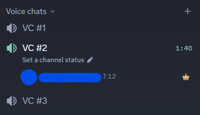

# VoiceTimeTracker

A BetterDiscord plugin that shows how long each user has been sitting in a voice channel, right next to their name in the sidebar.

Discord only shows voice duration for some voices, and often not at all, just as doesn't for specific users. VoiceTimeTracker fills that gap for every user, on every server you're a member of.

## Features

- Live timer next to every user in a voice channel.
- Works across all your servers.
- No API requests, no polling. Reads Discord's own in-memory state.
- Native look: uses Discord's own text colors and styling.
- Settings panel with a full list of tracked sessions.

## Installation

1. Install [BetterDiscord](https://betterdiscord.app/) if you haven't already.
2. Download `VoiceTimeTracker.plugin.js` from the [releases page](../../releases).
3. Drop the file into your BetterDiscord plugins folder:
   - Windows: `%AppData%\BetterDiscord\plugins`
   - macOS: `~/Library/Application Support/BetterDiscord/plugins`
   - Linux: `~/.config/BetterDiscord/plugins`
4. Restart Discord or press `Ctrl+R`.
5. Enable VoiceTimeTracker in Settings → Plugins.

## How it works

Discord already receives every voice state change through its gateway connection. The plugin reads that data, remembers when it first saw each user in voice, and renders a timer from that moment. Nothing is sent anywhere.

## Preview

    # General
       alice       12:34
       bob          3:21
       charlie    1:05:47

## Limitations

- Discord does not send voice states for servers you have never opened, so timers for those servers only start once you visit them.
- The timer starts from the moment the plugin first sees a user in voice. If someone was already sitting in a channel when you launched Discord, their timer begins then.

## Troubleshooting

Timers do not appear at all

- Check the console (`Ctrl+Shift+I`) for `[VoiceTimeTracker]` logs.
- Make sure the plugin is enabled under Settings → Plugins.
- Reload Discord (`Ctrl+R`).

Timers appear on some servers but not others

That is expected: Discord only caches voice states for servers it has loaded. Open the server once and timers will appear for it.

## License

MIT. See [LICENSE](LICENSE).

## Support

- Found a bug? [Open an issue](../../issues).
- Pull requests are welcome.

---

Made by [sameaslooks](https://github.com/sameaslooks).